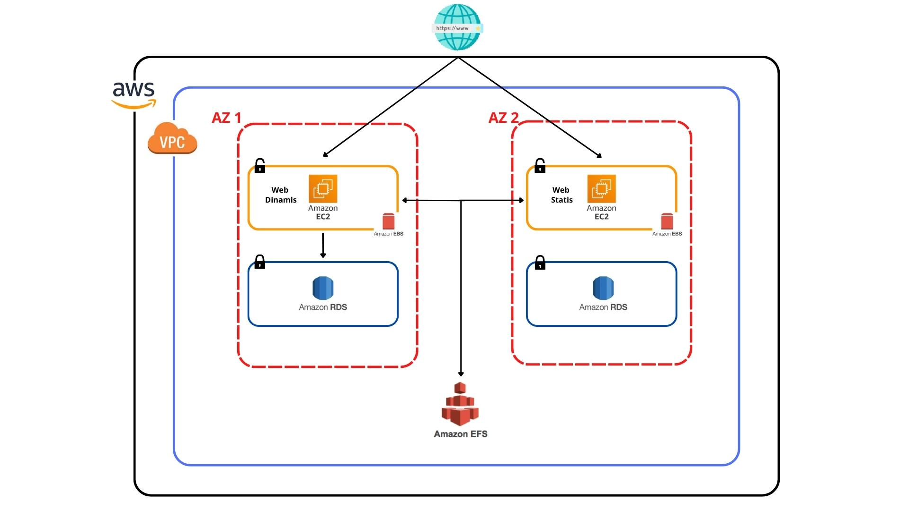

 

    
    <h3 align="center"> Expertise Class - Project 3 (Cloud Computing)</h3>
     

        Rangkuman soal dan topologi
    

     

# Topologi Project

**Berikut beberapa service AWS yang saya gunakan :**

- **Elastic Block Store (EBS)**
- **Elastic File System (EFS)**
- **Virtual Private Cloud (VPC)**
- **Elastic Compute Cloud (EC2)**
- **Relational Database Service (RDS)**

# Kasus
**Anda mendapatkan project untuk membuat 2 web (statis dan dinamis)**

# Goal
-    **User dapat membuat web dinamis di instance Ubuntu**
-    **User dapat membuat web statis di instance Debian**
-    **User dapat menghubungkan web dinamis dengan database**
-    **User dapat membuat direktori dan file di masing-masing EBS**
-    **Kedua EC2 (Debian dan Ubuntu) dapat terhubung ke EFS**

# Ketentuan
- **Website diupload di Github**
- **IP VPC : 192.168.1.0/25**  

     - **Subnet Public 1    :  192.168.1.0/27** 

     - **Subnet Private 1  :  192.168.1.32/27**

    - **Subnet Public 2    :  192.168.1.64/27**

    - **Subnet Private 2  :  192.168.1.96/27**
- **Membuat dua instance dengan OS yang berbeda**
- **Instance 1 menggunakan OS Ubuntu**
- **Instance 2 menggunakan OS Debian**
- **Name tag EC2 : WebServer_Ubuntu dan WebServer_Debian**    
- **Membuat 2 EBS Volume untuk di mount di masing-masing instance**
- **Name tag EBS : Volume_Ubuntu dan Volume_Debian**
- **User dapat membuat direktori dan file txt di masing-masing EBS**
- **Nama direktori : ebs-ubuntu dengan file ubuntu.txt dan ebs-debian dengan file ubuntu.txt**
- **Kedua EC2 (Ubuntu dan Debian) dapat terhubung ke EFS (ditest dengan cara membuat direktori dari kedua instance)**
- **Rsync isi dir web dinamis /var/www/html ke ebs**
- **Rsync isi /var/log ke efs**